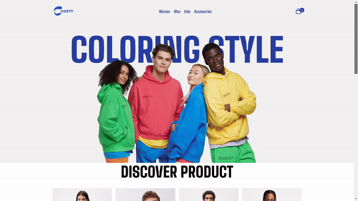
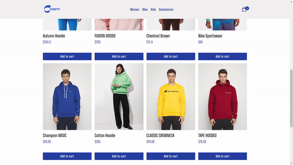
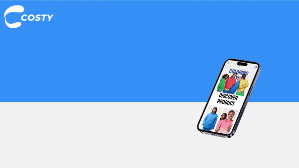

# COSTY E-Ticaret Web Sitesi

Bu proje, COSTY adında bir e-ticaret web sitesinin demo versiyonudur. Gerçek bir site olmayıp, frontend geliştirme becerilerini sergilemek ve geliştirmek amacıyla hazırlanmıştır.

# [COSTY Web Sitesini Ziyaret Et](https://costyshop.vercel.app/index.html)

## Proje Hakkında

COSTY, kullanıcıların ürünleri görüntüleyebileceği ve sepetlerine ekleyebileceği basit ve kullanıcı dostu bir e-ticaret platformudur. İki ana sayfadan oluşmaktadır:

1. **Mağaza Sayfası (Bağaza):**
   - Kullanıcılar çeşitli ürünleri burada görüntüleyebilir.
   - Ürünler arasında arama yapabilir ve filtreleme seçenekleri ile istedikleri ürünleri bulabilirler.
   - Her ürünün detayı, fiyatı ve resmi bulunmaktadır.
 

2. **Sepet Sayfası:**
   - Kullanıcılar mağaza sayfasından seçtikleri ürünleri burada görüntüleyebilirler.
   - Sepetteki ürünlerin adetini artırabilir veya azaltabilirler.
   - Toplam fiyat hesaplamaları otomatik olarak güncellenir.
  

## Teknolojiler

Bu proje şu teknolojiler kullanılarak geliştirilmiştir:
- HTML5
- CSS3
- JavaScript

## Gereksinimler

- Web tarayıcısı (Chrome, Firefox, Safari, vb.)
- Internet bağlantısı

